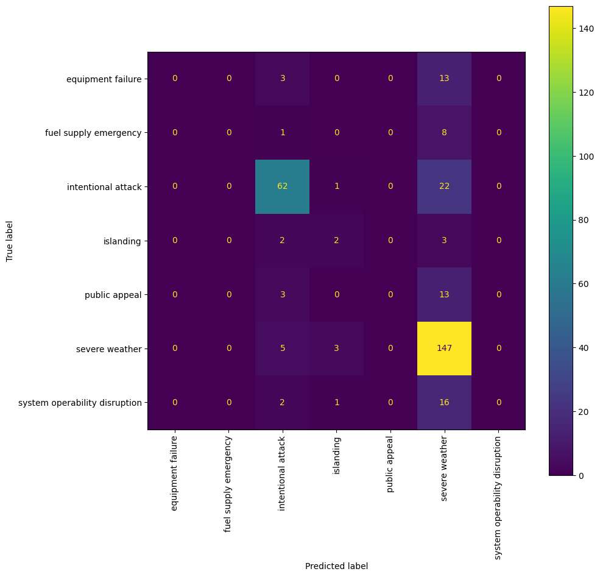
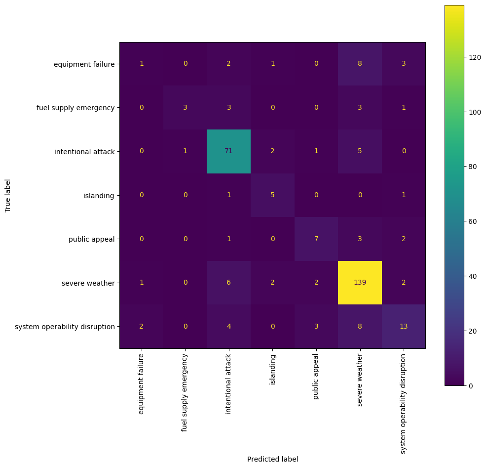

# Power Outage Cause Predictions 
Predicting the cause of power outages in the continental U.S.

## Framing the Problem 

In my [last project using this dataset](https://matteoperona.github.io/usa-power-outage-analysis/) I looked into the relationship between power outages per capita and instances of intentional attack relative to other outage causes. I found that areas with high outage per capita were much more likely to have a relatively high proportion of outages caused by intentional attacks. This time, I will explore the same vein of interest backwards: training some models to predict the cause category (**CAUSE.CATEGORY** in the dataset) of a given power outage. I chose cause category because it broadly categorizes the cause of a given power outage into seven categories ('severe weather', 'intentional attack', 'system operability disruption', 'equipment failure', 'public appeal', 'fuel supply emergency', and 'islanding') which lend themselves well to a **multiclass classification**. This model will, hopefully, give us a finer understanding of outage causes, and help us to understand which features are most relevant when assessing a given region's propensity toward certain types of outage. Equipped with this information, municipalities might better prepare for future outages.

For this **classification** problem all columns in the dataset should be fair game except for the CAUSE.CATEGORY.DETAIL and HURRICANE.NAME as they would both be unknown if we did not know the cause of the outage. The rest of our dataset contains information about datetime, location, climate, extent, regional electricity consumption, regional economic characteristics, and regional land-use characteristics, all of which could be known before the cause. 

To assess the performance of the model we will be using accuracy, and F1 score.

## Baseline Model

To start we'll create a baseline model using:
- U.S._STATE (nominal variable containing the US State in which the outage occurred)
- OUTAGE.DURATION (quantitative variable containing the outage duration in minutes)

To predict:
- CAUSE.CATEGORY (nominal variable describing the cause of a given power outage)

> We are removing Alaska from our data because there are not enough observations to make it viable for our model. <br>
> We are not using any ordinal data for this model.

Let's grab our baseline data from our outage dataframe:

```py
# Separate relevant data 
baseline_data = outage[['U.S._STATE', 'OUTAGE.DURATION', 'CAUSE.CATEGORY', 'CUSTOMERS.AFFECTED']]

# Remove Alaska from the data because there arent enough observations to include it in our model
baseline_data = baseline_data[baseline_data['U.S._STATE'] != 'Alaska']
```

Here's the baseline_data's head:

| U.S._STATE   |   OUTAGE.DURATION | CAUSE.CATEGORY     |   CUSTOMERS.AFFECTED |
|:-------------|------------------:|:-------------------|---------------------:|
| Minnesota    |              3060 | severe weather     |                70000 |
| Minnesota    |                 1 | intentional attack |                  nan |
| Minnesota    |              3000 | severe weather     |                70000 |
| Minnesota    |              2550 | severe weather     |                68200 |
| Minnesota    |              1740 | severe weather     |               250000 |

### Step One: Train Test Split

Our first step is to separate our data into training and testing data. We separate variables we are predicting from the rest of our data then sample our data at random, reserving 80% as training data to fit our model and 20% to test our model on unseen data.

```py
df = baseline_data

# Define X and y 
X = df.drop(columns=['CAUSE.CATEGORY'])
y = df['CAUSE.CATEGORY']

# Split into training and testing data (stratifying by U.S._State)
X_train, X_test, y_train, y_test = train_test_split(X, y, test_size=0.2, stratify=X['U.S._STATE'])
```

 One important thing to note at this stage is that we had to stratify our data when splitting into training and testing sets using the U.S._STATE variable. This makes sure that both training and testing data have relatively equal proportions of observations from each state. Without this step, we could run into problems where not all states represented in the testing set were included -- and one-hot encoded -- with the training set.

### Step Two: Preprocessing and Pipeline

Next, we want to create our column transformer to preprocess our data and our pipeline to run the preprocesses and fit our model. 

We are only using two transformers:
- A KNNImputer to handle missing data in the OUTAGE.DURATION column
- A OneHotEncoder to encode the nominal data in the U.S._STATE column

I've gone for a random forest classifier here because it's [less influenced by outliers](https://stats.stackexchange.com/questions/187200/how-are-random-forests-not-sensitive-to-outliers) than other algorithms and can [implicitly handle multicollinearity](https://stats.stackexchange.com/questions/141619/wont-highly-correlated-variables-in-random-forest-distort-accuracy-and-feature). 

```py
# Stage all preprocessing steps
preproc = ColumnTransformer(
    transformers=[
        ('impute_duration', KNNImputer(), ['OUTAGE.DURATION', 'CUSTOMERS.AFFECTED']),
        ('one_hot', OneHotEncoder(), ['U.S._STATE']),
    ],
    remainder='passthrough'
)

# Create final pipeline
pl = Pipeline([
    ('preprocess', preproc), 
    ('classifier', RandomForestClassifier(n_estimators=100, max_depth=6))
])
```

### Step Three: Fit and Model Eval 

Finally, we can fit our model with out training data and evaluate how "good" our predictions are.

```py
# Fit model to training data
pl.fit(X_train, y_train)

# Make predictions 
y_pred = pl.predict(X_test)

# Calculate accuracy and f1 score 
acc = (y_pred == y_test).mean()
f1 = f1_score(y_pred=y_pred, y_true=y_test, labels=y.unique(), average='weighted')
```

Here we are using using a weighted average on each partial f1 score to come up with out final value. This gives us the weighted average of the the harmonic means of precision and recall for each cause category: a value between 0 (worst) and 1 (best) telling us how well our model performed. 

#### Baseline Model Performance

Accuracy: 0.69

F1: .61

The baseline model seems to have given lukewarm results. While the accuracy is nearly 70% the F1 score is about .1 less, which tells us that recall (True Positive / All Actual Positive) is not stacking up. To give a better understanding here is a confusion matrix for this model. 



Pay attention to the diagonal, this is where the count of correct predictions lies. We can see that intentional attack, and severe weather are the only two categories which are being predicted with any accuracy. This makes sense because we can see that they are, by far, the most well represented categories in our dataset. If we did not take a weighted average when calculating our overall f1 score, it would be much lower since the model is really only able to predict those two categories. 

So is this model good? I would conclude that it is not good because it can only predict two categories with any accuracy, and, even then, the model's recall is not very good. 

Let's make some improvements.

## Final Model 

The final model will consist of the following variables for the following reasons:
1. U.S._STATE (string; the name of the U.S. state in which the outage occurred)
   - Lends geographical context to the data; certain outage causes are probably more common in select states
2. ANOMALY.LEVEL (float64; This represents the oceanic El Niño/La Niña (ONI) index referring to the cold and warm episodes by season)
   - Gives perspective on climate during that power outage. If El Niño is in full swing, it may be far more likely to see outages caused by extreme weather.
3. OUTAGE.DURATION (float64; The duration of the power outage in minutes)
   - Adds temporal context. Longer outages may be linked with select causes.
5. DEMAND.LOSS.MW (float64; Amount of peak demand lost during an outage event (in Megawatt))
   - Gives context to the extent of the power outage from the grid's perspective. Knowing the extent to which the outage impacted the grid could be very indicative of the type of cause of the outage. Certain causes probably lead to much more drastic losses.
6. CUSTOMERS.AFFECTED (float64; Number of customers affected by the power outage event)
   - Gives context to the extent of the power outage from a population perspective which could indicate. The number of people affected, like the amount of demand lost, could indicate higher likelihood for certain causes.
7. AREAPCT_URBAN (float64; Percentage of the land area of the U.S. state represented by the land area of the urban areas)
   - Adds context about land use. More urban land could indicate higher risk for intentional attacks, or, perhaps, less urban land would indicate a higher propensity for wind storms.
8. PCT_LAND (float64; Percentage of land area in the U.S. state as compared to the overall land area in the continental U.S.)
   - Describes the size of the state in which the outage occurred relative to other U.S. states. The smaller the state is the more titrated its list of climate related outages might be.
9. PCT_WATER_TOT (float64; Percentage of water area in the U.S. state as compared to the overall water area in the continental U.S.)
   - Describes the percentage of all water in the U.S. contained within the outage's state. This information could imply certain climate conditions which could indicate a higher propensity for certain types of power outage.
10. POPULATION (int64; Population in the U.S. state in a year)
   - This adds context to CUSTOMERS.AFFECTED and PCT_LAND. The proportion of people in the state affected by the outage as well as the proportion of people in the state relative to its size could both be important indicators of a given cause.

The broad strokes for the model creation are the same so I will put the code below and explain the differences later.

```py
# Separate relevant data 
final_data = outage[[
    'CAUSE.CATEGORY',
    'U.S._STATE',
    'ANOMALY.LEVEL', 
    'OUTAGE.DURATION',
    'DEMAND.LOSS.MW',
    'CUSTOMERS.AFFECTED',
    'AREAPCT_URBAN',
    'PCT_LAND',
    'PCT_WATER_TOT',
    'POPULATION'
]]

# Remove Alaska from the data because there arent enough observations to include it in our model
final_data = final_data[final_data['U.S._STATE'] != 'Alaska']

# Define X and y 
X = final_data.drop(columns=['CAUSE.CATEGORY'])
y = final_data['CAUSE.CATEGORY']

# Split into training and testing data (stratifying by U.S._State)
X_train, X_test, y_train, y_test = train_test_split(X, y, test_size=0.2, stratify=X['U.S._STATE'])

# Create transformer for datetimes
dt_to_ts = lambda d: d.apply(
    lambda col: col.apply(
        lambda x: datetime.timestamp(s)))
dt_transformer = FunctionTransformer(dt_to_ts)

impute_and_standardize_standard = Pipeline(steps=[
    ('impute', KNNImputer()),
    ('standardize', StandardScaler()),
])

impute_and_standardize_quantile = Pipeline(steps=[
    ('impute', KNNImputer()),
    ('standardize', QuantileTransformer()),
])

# Stage all preprocessing steps
preproc = ColumnTransformer(
    transformers=[
        ('impute_and_standardize_standard', impute_and_standardize_standard, [
            'DEMAND.LOSS.MW', 
            'CUSTOMERS.AFFECTED',
            'OUTAGE.DURATION',
            'AREAPCT_URBAN',
            'PCT_LAND',
            'PCT_WATER_TOT',
            'POPULATION'
            
        ]),
        ('impute_and_standardize_quantile', impute_and_standardize_quantile, [
            'ANOMALY.LEVEL', 
        ]),
        ('one_hot', OneHotEncoder(), ['U.S._STATE']),
    ],
    remainder='passthrough'
)
```

The main differences come in the form of ```impute_and_standardize_quantile``` and ```impute_and_standardize_standard```. Each of them imputes values using a KNNImputer then standardizes the data according to either QuantileTransformer or StandardScaler. In my tests, ANOMALY.LEVEL was the only variable which performed better when standardized using QuantileTransformer, perhaps because it had outliers. I fed the rest of my quantitative variables thorugh the standard pipeline. 

Before moving to the next section I'll add that I'm going with RandomForest again for this final model for the same reasons that made me choose it in the baseline model. 

### Hyperparameter Tuning 

In this section, we'll iteratively find the best possible parameters for our random forest classifier. I'm tuning ```max_depth``` and ```n_estimators``` because they are the two most important paramenters to a random forest's functionality, and because tuning more parameters becomes extremely time heavy. ```max_depth``` governs the maximum height upto which the trees inside the forest can grow. ```n_estimators``` controls the number of trees inside the classifier. 

We do this using Sklearn's GridSearchCV which allows us to perform an exhaustive search for the best parameters by fitting all combinations of passed hyperparameters. The code looks like this:

```py
# Define Hyperparameters
hyperparameters = {
    'max_depth': [2, 3, 4, 5, 7, 10, 13, 15, 18, None], 
    'n_estimators': [2, 5, 10, 20, 50, 100, 200],
}

# Hyperparameter Tuning
# Create final pipeline with Grid Search to find best hyperparameters
pl = Pipeline([
    ('preprocess', preproc), 
    ('hp_tuning', GridSearchCV(RandomForestClassifier(), hyperparameters, cv=5))
])

# Fit model to training data and calculate best params
pl.fit(X_train, y_train)
pl.steps[1][1].best_params_
```

By exctracting the grid search from our pipeline I'm able to retrieve the best parameters, which in this case were:```{'max_depth': None, 'n_estimators': 200}```. However, after further testing with more titrated hyperparameters I came up with: ```{'max_depth': 30, 'n_estimators': 65}```.

Using these we can fit out final model:
```py
# Create final pipeline 
pl = Pipeline([
    ('preprocess', preproc), 
    ('model', RandomForestClassifier(max_depth=30, n_estimators=65))
])

# Fit model to training data and calculate best params
pl.fit(X_train, y_train)
```

### Model Eval

As before we'll calculate the f1 score and accuracy:
```py
# Make predictions 
y_pred = pl.predict(X_test)

# Calculate accuracy 
acc = (y_pred == y_test).mean()

# Calculte f1 score 
f1 = f1_score(y_pred=y_pred, y_true=y_test, labels=y.unique(), average='weighted')
```
Accuracy: 0.78

F1: 0.76

> Our values for accuracy and F1 are much more similar indicating that our Recall and Accuracy are performing at similar levels. The model improved!

This is a massive improvement over our last model. We can attribute this to:
1. Our broader set of input variables contributing more information which to contextualize our model.
2. The extra feature engineering done to standardize the columns according to their data generating process.
3. The hyperparameter tuning we did in the previous section. 

Note that while the Accuracy went up by .09 the f1 score went up by 0.15! This means that our recall improved by a wide margin. In other words, our model is more precise and much better at capturing entire groups in its classification. 

Let's take a look at the confusion matrix for this model. 



Note the diagonal; it seems as though all categories have improved significantly in both recall and accuracy barring severe weather whose recall improved and accuracy diminished. It would be interesting to look into why the severe weather changed in such a way. None the less, the confusion matrix corroborates the changes we see to our f1 score. 

In conclusion, is this model good? I would say that the model is ok. Remember that our f1 score is a weighted average of f1 scores for each cause category; many of which are still performing quite poorly: ```[0.87, 0.85 , 0.50, 0.11, 0.54, 0.43, 0.59]```. For this model to become "good" we would need to collect more data to get better predictions for categories that aren't severe weather or intentional attack. 

## Fairness Analysis

In this section we'll examine the fairness of the model we just trained. We will check whether the algorithm seems to have better predictions for outages which occur in **more populous states (>= 20M pop)** as compared to the **less populous states (< 20 M pop)** in the continental United States. To quantify this comparison we will be running a 500-rep permutation test using a significance level of 0.05 and f1 as our evaluation metric. 

##### Hypothesis
**Null:** Our model is fair. Its f1 score for populous states is roughly the same as that of less populous states. Any differences are due to random chance. 

**Alt:** Our model is unfair. The f1 score for more populous states is significantly different from that of less populous states. 

#### Run Test

```py
# Find populous/less populous states in testing data
is_populous = X_test['POPULATION'] >= 20_000_000

# Find observed f1
observed_pred = pl.predict(X_test[is_populous])
observed_f1 = f1_score(y_pred=observed_pred, y_true=y_test[is_populous], labels=y.unique(), average='weighted')
print('Observed: ', observed_f1)


# Run permutation test 
n_repetitions = 500

f1_scores = []
for _ in range(n_repetitions):
    # Shuffle the is_populous series
    shuffled = np.random.permutation(is_populous)
    
    # Compute the test statistic 
    test_pred = pl.predict(X_test[shuffled])
    test_f1 = f1_score(y_pred=observed_pred, y_true=y_test[shuffled], labels=y.unique(), average='weighted')
    f1_scores.append(test_f1)


f1_scores[:10]
```

##### Out:

```
Observed:  0.5196368032188928

[0.3146641791044776,
 0.15636105188343993,
 0.3584310589907605,
 0.3166774821544452,
 0.24184939961844912,
 0.2700027712894414,
 0.3056456846203764,
 0.23217247097844115,
 0.35600407055630934,
 0.2699545749513303]
 ```


#### P-Value

```py
# Calculate p-value
(f1_scores >= observed_f1).mean()
```

##### Out:

0.0


### Conclusions

<iframe 
    src="./assets/biase_perm_test_empirical_dist_hist.html"
    alt="biase_perm_test_empirical_dist_hist"
    style="width:100%; height:500px;"
></iframe>

We can clearly see that the p-value, 0.0, is less than our significance level, 0.05, so we reject our null hypothesis. This means that f1 scores resulting from predictions on more populous states are likely different from the f1 scores we get on less populous states. Our permutation test indicates that our algorithm may perform differently given a state's population. 